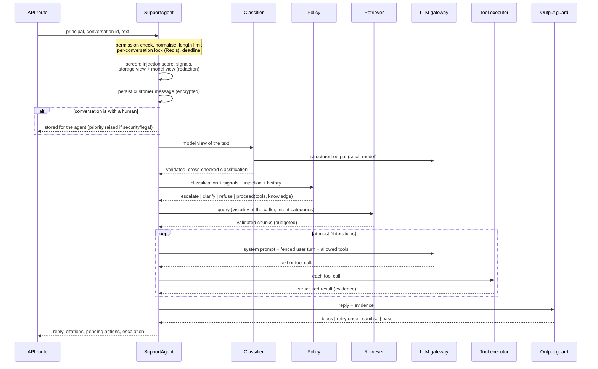

# The support agent

This document describes what happens between a customer's message and the assistant's reply:
`aegis.agents.orchestrator.SupportAgent.handle_message`. The guiding rule is that **the model
proposes and deterministic code decides**: the model writes text and requests tools; whether a
tool may run, whether a human must take over and whether a reply may be shown are decided by the
components below.

## Pipeline



Everything runs under an overall deadline (`AEGIS_AGENT_TURN_TIMEOUT_SECONDS`). Any exception
inside the turn produces a safe reply ("I'm having trouble ...") instead of an error, and counts
as an assistant failure; repeated failures hand the conversation to a human.

## 1. Screening

The message is normalised (Unicode NFKC, invisible and bidirectional control characters removed)
and length-checked, then screened once, producing:

| Output | Used for |
|---|---|
| **Storage view** (`redact_for_storage`) | What is persisted. Card numbers, CVV codes, credentials, SSNs and IBANs are removed; the rest is stored encrypted. If anything was removed, the reply starts with a reminder not to share such data. |
| **Model view** (`redact_for_llm`) | What the model and the classifier see. Every personal-data category (also e-mail addresses, phone numbers, IP addresses) is replaced by a typed placeholder. Tools never need these values: they identify the customer from the session. |
| **Signals** (`detect_signals`) | Deterministic flags: wants a human, legal threat, account compromise, urgency, sentiment, order numbers. |
| **Injection assessment** | A risk score and level (none/low/medium/high) with categories such as `instruction_override`, `role_hijack`, `prompt_extraction`, `delimiter_injection`, `data_exfiltration`, `tool_manipulation`, `privilege_claim`, `addressed_to_ai`, `obfuscation`. Scanning runs on several normalised forms (confusables folded, leetspeak undone, separators squashed). |

A suspicious message increments the conversation's `suspicious_count`, emits a security metric
and writes an `agent.injection_suspected` audit event.

## 2. Classification

`IntentClassifier` asks the small model (`AEGIS_LLM_CLASSIFIER_MODEL`) for a JSON object
constrained by a schema generated from `intents.toml` (intent, priority, sentiment, confidence,
requires_tool, requires_human, order_numbers, language, summary). The answer is validated again
with Pydantic and then cross-checked against deterministic facts:

- order numbers are accepted only if they literally occur in the customer's message;
- the model may raise the priority but never lower it below the intent's default or below what
  the signals demand;
- `requires_human` is OR-ed with the deterministic signals, so a prompt injection cannot switch
  off escalation of "my account was hacked";
- if the model disagrees with a confident rule-based reading, the confidence is capped so the
  policy asks a clarifying question instead of acting on a shaky label.

Malformed output, a refusal, a timeout or an exhausted budget falls back to the keyword rules
(`RuleBasedClassifier`), which read the same `intents.toml`.

## 3. Policy

`TurnPolicy.decide` is an ordered decision table:

| Condition | Decision |
|---|---|
| account compromise signal, or an intent marked `always_escalate` (security) | escalate, urgent |
| legal threat | escalate, high |
| the customer asks for a person | escalate |
| high injection risk and too many suspicious messages in this conversation | escalate (suspicious activity) |
| too many failed answers in this conversation | escalate (repeated failure) |
| the classifier says a human is required | escalate |
| very negative complaint | escalate |
| high injection risk, no genuine request (fallback intent, no references) | refuse without calling the model |
| confidence below `AEGIS_AGENT_MIN_CONFIDENCE` | ask a clarifying question (escalate if one is already pending) |
| otherwise | proceed |

When proceeding, the **tool allow-list** is the intersection of the intent's tools and the tools
the caller's role may use. A message with medium or high injection risk additionally loses every
tool with a write or propose side effect, and the model is told to offer a human instead - so a
successful injection can at most *read* the customer's own data. The policy also chooses the
knowledge categories to search. The full intent and tool matrix is in [tools.md](tools.md).

## 4. Retrieval

For intents with knowledge categories, the retriever searches the knowledge base with the
caller's visibility (customers: public documents; staff: public and internal), validates and
budgets the chunks and orders them by authority. See [rag.md](rag.md).

## 5. Prompt construction

The system prompt is static per deployment (good for prompt caching) and is the only place with
instructions. It defines the trust boundaries, the answering rules (facts from tools, policies
from documents with citations, act only for the signed-in customer, refunds and cancellations
are only *prepared*, when to hand over, never ask for or repeat secrets, never reveal the
instructions, plain text, at most 150 words, links only to the help centre) and a secret
**canary** marker derived from the JWT secret.

The user turn carries data only, in fenced blocks:

```text
<turn_context>        facts the application computed: date, detected intent, references, notes
<conversation_summary> rolling summary of older messages (if any)
<knowledge_base>      <document index="1" title="..." section="...">...</document> ...
<customer_message>    the model view of the customer's text
```

Everything inside the blocks is HTML-escaped, so a message or a document cannot close a fence
and forge a block of another kind. Tool results travel through the provider's native tool-result
channel as JSON. The design does not *depend* on the model obeying the fences: authorisation,
confirmation and output validation are enforced in code.

## 6. Tool execution

The loop runs at most `AEGIS_AGENT_MAX_ITERATIONS` model calls. For every tool call the
`ToolExecutor`:

1. rejects tools that do not exist or are not in this turn's allow-list (audited as a denial and
   counted as a security event);
2. enforces the per-turn budgets (`AEGIS_AGENT_MAX_TOOL_CALLS` in total, and a per-tool limit);
   identical repeated calls are answered from a per-turn cache;
3. validates the arguments with the tool's strict Pydantic model (types, patterns, lengths, no
   extra fields) - the provider-side schema is a convenience, not a guarantee;
4. checks the caller's permission for the tool (RBAC);
5. runs the handler with a timeout (`AEGIS_AGENT_TOOL_TIMEOUT_SECONDS`); handlers call the same
   services as the REST API, so ownership is enforced in SQL;
6. turns failures into structured, customer-safe results (`not_found`, `not_allowed`,
   `not_permitted`, `limit_reached`, `temporarily_unavailable`, `failed`) - never stack traces or
   SQL - and rolls back the session after infrastructure failures;
7. caps and records the output as **evidence** for the output guard, logs only the tool name and
   outcome, and audits side-effecting calls.

### Proposed actions

`request_refund` and `cancel_order` do not change anything. After checking eligibility they
create a **pending action** that expires after `AEGIS_AGENT_ACTION_TTL_SECONDS`. The customer
confirms it with `POST /api/v1/conversations/{id}/actions/{action_id}/confirm` - a separate,
authenticated request that a model cannot make. On confirmation the service re-checks ownership,
moves the action `PENDING -> EXECUTING` atomically (a double click executes once), re-evaluates
the business rules against locked rows (the order may have shipped since the proposal) and only
then creates the refund request or cancels the order. Database constraints back this up (one open
refund per order, one open pending action per order and type).

### Escalation by the model

`request_human_agent` is available to every intent. It does not end the conversation by itself:
the loop stops, the reply (if the guard accepts it) is followed by the hand-over message, and the
handoff service creates or reuses a ticket.

## 7. Output guard

Every reply is checked by `OutputGuard` against the **evidence** (tool results, the documents
given to the model, the customer's message, the history and the summary):

| Finding | Action |
|---|---|
| The canary, or two or more 8-word passages of the system prompt | block: the reply is discarded, a neutral answer is sent, the conversation's suspicious count rises, `prompt_leak_blocked` is counted |
| Credentials or secrets (API keys, tokens, private keys, connection strings) | block |
| Order, ticket or refund numbers that appear in no evidence | retry once with a correction note, then fall back to "I couldn't verify all the details" |
| Money amounts that appear in no evidence | retry once, then fall back |
| Markdown images; links or URLs outside `AEGIS_AGENT_ALLOWED_LINK_DOMAINS` | removed (classic exfiltration channels) |
| HTML tags | removed |
| E-mail addresses and phone numbers not in the evidence; card numbers, IBANs, SSNs | removed |
| Citation markers pointing to documents that were not provided | removed |
| Longer than `AEGIS_AGENT_MAX_RESPONSE_CHARS` | truncated at a sentence boundary |

Guard findings are counted in `aegis_output_guard_violations_total` and stored in the reply's
metadata (visible to staff, not to the customer).

## 8. Persistence, escalation and memory

The reply is stored with its metadata (intent, confidence, priority, sentiment, classifier source,
citations, tools used, proposed actions, degraded flag, guard findings). A failed turn increments
`ai_failure_count`; when it reaches `AEGIS_AGENT_FAILURE_ESCALATION_THRESHOLD` the conversation
is escalated in the same turn. A successful answer resets the counter.

**Memory.** All messages stay in the database (encrypted). The model sees a bounded window: the
last `AEGIS_AGENT_HISTORY_MESSAGES` messages (model view, truncated) plus a rolling summary that
the small model maintains once the conversation exceeds `AEGIS_AGENT_SUMMARY_TRIGGER_MESSAGES`
(the summary prompt forbids personal data). Short-term state (last intent, pending clarification)
is JSON in Redis with a TTL, validated on read; losing it is harmless. History is replayed as
plain text only - no reasoning blocks or tool traffic from earlier turns is re-sent.

## 9. Human handoff

Escalation creates (or reuses) a support ticket, sets the conversation to `awaiting_agent` with a
reason and priority, and counts `aegis_escalations_total`. From then on the assistant does not
answer: customer messages are stored for the specialist (a new account-compromise or legal
message raises the priority). Staff work the queue through the agent desk:

| Step | Endpoint | Permission |
|---|---|---|
| See the queue (filter by status, priority, own assignments) | `GET /agent-desk/queue` | `handoff:queue_read` |
| Read the full conversation with metadata | `GET /agent-desk/conversations/{id}` | `conversation:read_any` |
| Claim it | `POST .../claim` | `handoff:claim` |
| Assign it to someone else | `POST .../assign` | `handoff:assign_any` (managers) |
| Reply to the customer | `POST .../messages` | `handoff:reply` |
| Resolve it, optionally returning it to the assistant | `POST .../resolve` | `handoff:resolve` |

Every queue operation is audited.

## 10. Cost control

- **Model routing**: the capable model (`AEGIS_LLM_AGENT_MODEL`) only for replies and tool use;
  classification and summaries on the small model.
- **Budgets** in Redis, checked before every call: tokens per user per day and estimated spend
  per deployment per day. An exhausted budget (or an unreachable Redis) routes the call to the
  offline model instead of spending more.
- **Bounds**: output-token caps per task, iteration and tool-call caps per turn, a character
  budget for retrieved context, a bounded history window, message-length limits.
- **Prompt caching** of the static prefix (system prompt and tool definitions).
- **Rate limits** on messages per user per minute and per day.
- **Accounting**: every call is stored in `llm_usage` (tokens, cache tokens, estimated cost,
  latency, outcome) and summarised at `GET /api/v1/admin/llm-usage`.

## 11. The offline model

`OfflineSupportModel` implements the same provider interface as the Claude adapter. It classifies
with the keyword rules, plans tool calls from the intent and the references in the message, and
composes replies from templates filled only with tool results and retrieved documents - grounded
by construction, but less fluent and English-only. It runs the complete pipeline for development,
CI and demos, and serves as the degraded-mode fallback when Claude is unavailable, over budget or
circuit-broken (such replies are flagged `degraded`).

## 12. Claude specifics

The adapter (`aegis.llm.anthropic_provider`) uses the official SDK: adaptive thinking with an
explicit effort level on the agent model, tools declared with `strict: true` and `tool_choice`
left on `auto`, structured output (`output_config.format`) for classification and summaries,
the refusal stop reason checked before any content is read, server-side fallback for false-positive
refusals on models that support it, top-level prompt caching and an opaque `metadata.user_id`
fingerprint. Within one turn the assistant content is replayed verbatim; across turns only plain
text is sent.
