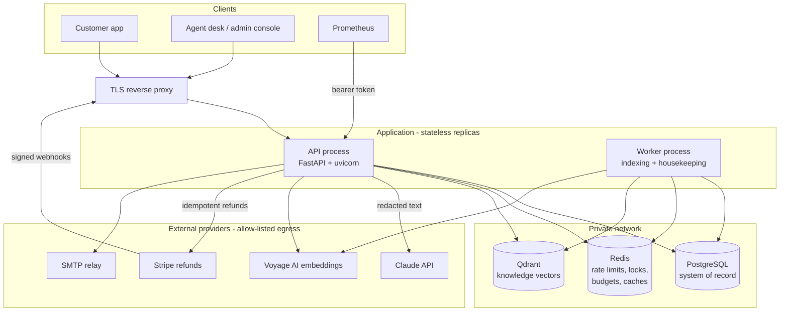
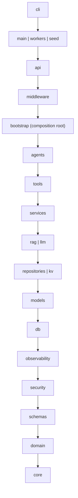
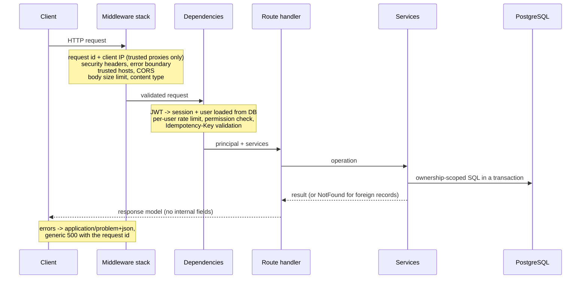
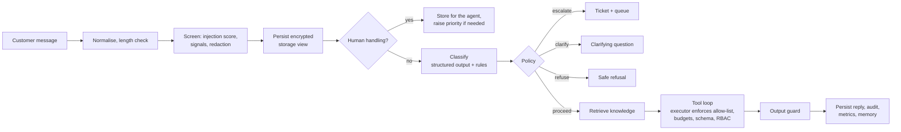

# Architecture

AegisSupport AI is a **modular monolith**: one Python package (`aegis`) deployed as two process
types - the API and the worker - on top of PostgreSQL, Redis and Qdrant. A single deployable keeps
transactions, authorisation and auditing in one place; strict internal layering keeps the
modules independent enough to split later if the load ever demands it.

## Design goals

1. **The model is an untrusted component.** It can be manipulated by customer text and by
   documents, so it only *proposes* (a reply, a tool call). Authorisation, tool selection, risk
   decisions and output validation are deterministic code.
2. **Security by construction, not by convention.** Ownership filters live in the SQL queries,
   the layering is enforced by import-linter, secrets are typed so they cannot be logged, and the
   runtime database role physically cannot alter the schema or the audit trail.
3. **Graceful degradation.** Every external dependency (model API, embeddings, Redis, Qdrant) has
   a timeout and a defined failure mode; the customer always gets a safe answer.
4. **Runs anywhere.** The whole pipeline works offline (SQLite, embedded Qdrant, in-process
   store, deterministic model), so development, CI and demos need no accounts or network.

## Runtime view

| Component | Role | State |
|---|---|---|
| API process | REST API, the support agent, authentication, rate limiting | none (stateless; scale horizontally) |
| Worker | Indexes pending knowledge documents, expires stale pending actions, purges expired tokens and idempotency keys | none |
| PostgreSQL | Users, sessions, second factors, customers, orders, payments, refunds, tickets, conversations, pending actions, knowledge documents, audit trail, model usage | durable |
| Redis | Rate-limit windows, per-conversation locks, daily model budgets, short-term conversation state, query-embedding cache | ephemeral; every key has a TTL |
| Qdrant | Chunk vectors with visibility, category, slug and version in the payload | rebuildable from PostgreSQL |

## Layers

A module may import only from layers below it. [import-linter](https://import-linter.readthedocs.io/)
checks this contract plus four prohibitions on every run (`uv run lint-imports`):

| Contract | Why |
|---|---|
| `aegis.llm` cannot import SQLAlchemy, repositories, models, db or services - even indirectly | The code that talks to the model provider can never touch customer data directly. |
| `aegis.agents` and `aegis.tools` cannot import SQLAlchemy, repositories or db | The agent reaches data only through services, which enforce authorisation and ownership. |
| `aegis.api` cannot import repositories, the Anthropic SDK or the Qdrant client | Routes stay thin; every data access goes through a service. |
| `aegis.security`, `aegis.core`, `aegis.domain` cannot import FastAPI, Starlette, SQLAlchemy, Anthropic, Qdrant or Redis | Security primitives and business rules are framework-free and unit-testable. |

What each package holds:

| Package | Responsibility |
|---|---|
| `core` | Settings, typed errors, request context, time, identifiers, retry and circuit breaker, egress (SSRF) policy |
| `domain` | Enumerations, reference-number formats, refund-eligibility and cancellation rules |
| `schemas` | Pydantic request/response models (`extra="forbid"`, length limits) |
| `security` | Text normalisation, PII/secret redaction, injection detection, Argon2id, JWT/opaque tokens, TOTP and recovery codes, webhook signatures, RBAC, field encryption, upload validation |
| `observability` | JSON logging with a redaction filter, Prometheus metrics |
| `db`, `models` | Declarative base, column types (`UTCDateTime`, `EncryptedText`, `JSONType`), 20 tables |
| `repositories` | SQL: ownership-scoped queries, row locks, atomic state transitions |
| `kv` | Redis and in-process key-value stores, sliding-window rate limiter, distributed locks |
| `llm` | Provider interface, Claude adapter, strict JSON schema builder, pricing, gateway |
| `rag` | Chunking, embeddings, Qdrant store, retriever |
| `services` | Business operations with authorisation, ownership, transactions and audit |
| `tools` | Tool catalogue, registry and executor |
| `agents` | Intent registry, signals, classifier, policy, prompts, guard, memory, orchestrator, offline model |
| `middleware`, `api` | HTTP concerns and the versioned routers |
| `bootstrap` | The composition root that wires everything from settings |

## Composition root

`aegis.bootstrap.AppContainer` is built once per process from `Settings`. It owns everything with a
lifecycle - the database engine, the key-value store, the vector store, the embedder, the model
gateway, the e-mail sender - and closes them on shutdown. `RequestServices` builds the services
for one database session (one HTTP request or one worker iteration); they are created lazily, so a
request pays only for what it uses. No module reads settings or creates clients on its own, which
keeps every dependency visible and replaceable in tests (the suite swaps the model, the key-value
store and the clock this way).

## Request lifecycle

Middleware order, outermost first: `RequestContext` (request id, client address, access log, HTTP
metrics) -> `SecurityHeaders` -> `ErrorBoundary` (turns any unhandled exception into a generic
500) -> `TrustedHost` -> `CORS` (only when origins are configured) -> `BodySizeLimit` ->
`ContentType` -> FastAPI (exception handlers and routes).

## The agent turn

`POST /api/v1/conversations/{id}/messages` runs one agent turn under a per-conversation
distributed lock and an overall deadline:

The model only ever sees the **model view** of the message (all personal data replaced by
placeholders) and only the tools the policy allowed for this turn. The full pipeline is described
in [agent.md](agent.md).

## Where data lives

| Data | Where | Protection |
|---|---|---|
| Passwords | `users.password_hash` | Argon2id; never logged, never returned |
| Refresh and reset tokens | `refresh_tokens`, `password_reset_tokens` | only SHA-256 digests stored |
| Message text, ticket descriptions, conversation summaries, phone numbers, addresses, refund notes | PostgreSQL | encrypted per column (Fernet, key rotation) |
| Card numbers, CVV, credentials, SSNs, IBANs typed by customers | - | removed before storage (never persisted) |
| Payment card data | `payments` | brand and last four digits only (CHECK constraint) |
| Text sent to the model | Claude API | model view: every PII category replaced by placeholders |
| Knowledge-base documents | PostgreSQL + Qdrant | visibility enforced in the vector search |
| Audit events | `audit_events` | append-only (trigger + grants), details scrubbed |
| Logs | stdout (JSON) | identifiers and events only; redaction filter as a safety net |

## Concurrency and scaling

- **Stateless API**: sessions, rate limits, locks and budgets live in PostgreSQL and Redis, so any
  number of API replicas can run behind a load balancer.
- **One turn per conversation at a time**: a Redis lock with an owner token and a TTL serialises
  turns; the conversation row is additionally locked (`SELECT ... FOR UPDATE`) while it changes.
- **Exactly-once effects**: `Idempotency-Key` on message and ticket creation; pending actions move
  `PENDING -> EXECUTING` with a conditional `UPDATE`; refunds carry an idempotency key to the
  payment gateway; partial unique indexes allow only one open refund per order and one open
  pending action per dedupe key.
- **Workers scale out** safely: a document is claimed with an atomic `PENDING -> INDEXING`
  transition, and documents stuck in `INDEXING` return to the queue after 15 minutes.

## Failure modes

| Failure | Behaviour |
|---|---|
| Claude API down, timing out or rate-limited | Retries with backoff in the SDK, then the circuit breaker opens; turns are answered by the offline model and flagged `degraded` |
| Daily token or cost budget exhausted | Same offline fallback (or HTTP 429 when the fallback is disabled) |
| Model output malformed or a refusal | Classifier falls back to the rules; the agent sends a safe reply; repeated failures hand the conversation to a human |
| Qdrant unavailable | The assistant answers without documents and is told not to answer policy questions from memory; indexing is deferred |
| Redis unavailable | Rate limiting degrades to per-process counters (never fails open); model budgets count as exhausted (fail closed, offline answers); the per-conversation lock cannot be taken, so new messages get a 503 until Redis is back |
| PostgreSQL unavailable | The readiness probe reports it; requests fail with a generic 500 that carries only the request id - no partial writes |
| Payment provider down or refusing | An approval fails with `503` (retry later with the same idempotency key) or `409 payment_rejected` with the provider's code; the refund stays reviewable. A refund the provider accepted but has not finished stays `processing` until the signed webhook arrives |
| Worker down | Uploads stay `pending`; the heartbeat health check turns unhealthy |

## Prototype versus production

Some parts of the system stand in for things a real deployment would connect to. They are
labelled clearly, and production refuses the development stand-ins.

| Area | In this project | In production | Enforced |
|---|---|---|---|
| Model | Offline deterministic model by default; Claude via `AEGIS_LLM_PROVIDER=anthropic` | Claude, with the offline model only as degraded-mode fallback | configuration |
| Embeddings | Local feature hashing (lexical) | Voyage AI (semantic) | configuration |
| Database | SQLite for development and tests | PostgreSQL with the three-role layout | refused in production |
| Cache, limits, locks | In-process store when Redis is not configured | Redis with ACL | refused in production |
| Vector store | Embedded Qdrant | Qdrant server with API key | refused in production |
| E-mail | Development mailbox (files) | SMTP with STARTTLS | refused in production |
| Payments | `SimulatedPaymentGateway` (idempotent, in memory) by default | `StripePaymentGateway` (`AEGIS_PAYMENT_PROVIDER=stripe`) with signed webhooks; tested against a simulated transport, not against the live Stripe API | simulated refused in production |
| Customers, orders | Fictional seed data (`aegis seed`, refused in production) | The commerce system of record (the services are the integration point) | seed refuses production |
| Staff authentication | Passwords with Argon2id, lockout, optional TOTP | TOTP mandatory for staff (`AEGIS_MFA_REQUIRED_FOR_STAFF`); an identity provider with SSO could replace the built-in login | MFA policy required in production |

## Key design decisions

| Decision | Alternatives considered | Reason |
|---|---|---|
| Modular monolith | Microservices | One transaction and audit boundary; fewer network hops carrying personal data; the layering keeps a later split possible. |
| Deterministic policy decides escalation and tool access | Letting the model decide | A prompt injection must not be able to switch off escalation or unlock write tools. |
| Propose-then-confirm for refunds and cancellations | Letting the tool execute | The model can be manipulated; the customer's explicit API call is the authorisation. |
| Visibility filter inside the vector search | Filtering after retrieval | Internal documents cannot even be scored for a customer's query; the post-check is defence in depth. |
| Offline deterministic model | Mocks only in tests | The complete product works without a key, and it is the degraded-mode fallback in production. |
| Application-level column encryption | Relying on disk encryption only | Dumps, backups and replicas stay unreadable without the application key. |
| `httpx2` for outbound HTTP | `httpx` | It is the HTTP stack the Anthropic SDK is built on; one client stack, one set of timeouts and egress rules. |
| SQLite and embedded Qdrant for development | Docker for everything | A two-minute quick start and a fast test suite; production refuses both. |
