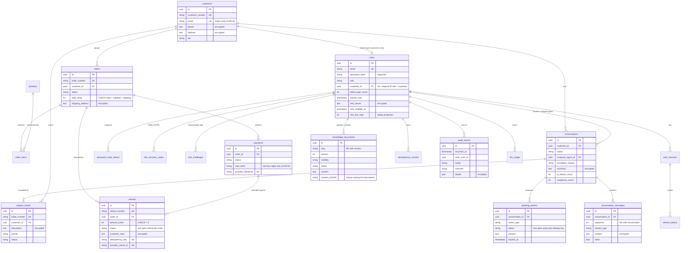

# Database

PostgreSQL is the system of record (SQLite is accepted only for development and tests). The
schema is defined by the SQLAlchemy models in `src/aegis/models` and created by Alembic
migrations; `alembic check` (run in the PostgreSQL test) proves that the two never drift apart.

## Entity-relationship diagram



(`products`, `auth_sessions`, `refresh_tokens`, `password_reset_tokens`, `mfa_recovery_codes`,
`mfa_challenges`, `idempotency_records` and `llm_usage` are omitted from the attribute lists for
brevity; see the models.)

## Tables

| Table | Purpose | Notes |
|---|---|---|
| `users` | Logins of customers and staff | Argon2id hash, lockout counters, `password_changed_at`, encrypted TOTP secret and last used step; a customer user must link to exactly one customer and staff must not (CHECK) |
| `mfa_recovery_codes` | Single-use recovery codes | SHA-256 digests only; `used_at` spent atomically |
| `mfa_challenges` | The second login step | Token digest, expiry, attempt counter (CHECK >= 0), spent atomically |
| `auth_sessions` | One row per login | Revocation reason, absolute expiry, IP and user agent |
| `refresh_tokens` | Rotating refresh tokens | SHA-256 digest only; `used_at` for single use and theft detection |
| `password_reset_tokens` | Single-use reset tokens | SHA-256 digest only, short expiry |
| `customers` | The commerce system's customer records | Phone and address encrypted; `erased_at` after an erasure |
| `products` | Catalogue | Non-negative price and warranty (CHECK) |
| `orders`, `order_items` | Orders and their lines | Amount consistency (CHECK), shipping address encrypted |
| `payments` | Payment attempts | Only card brand and last four digits; status and method from closed sets |
| `refunds` | Refund requests and their review | One open refund per order (partial unique index); idempotency key toward the payment provider; the provider's refund id (unique) to match webhook events |
| `conversations`, `conversation_messages` | Chats with the assistant and agents | Message text and summaries encrypted; per-conversation sequence numbers; `content_erased_at` after erasure or the retention period |
| `pending_actions` | Refunds/cancellations the assistant prepared | `PENDING -> EXECUTING` guarded by a conditional update; one open action per order and type |
| `support_tickets` | Tickets from customers, the assistant and escalations | Description encrypted; idempotency key |
| `knowledge_documents` | Knowledge-base documents and their lifecycle | Versions per slug; injection score and categories; content hash |
| `idempotency_records` | HTTP idempotency keys | Unique per (user, scope, key); expire |
| `audit_events` | Security audit trail | Append-only on PostgreSQL |
| `llm_usage` | One row per model call | Tokens, cache tokens, cost estimate, latency, outcome |

## Integrity rules in the database

The application checks its rules; the database enforces the ones whose violation would be a
security or money problem even if the application had a bug:

- **Closed value sets**: every status, role, reason and category column has a named CHECK
  constraint listing the allowed values (the migration uses `VARCHAR` + CHECK rather than native
  enums, so adding a value is a simple migration).
- **Money**: non-negative amounts, `total = subtotal + shipping`, refund amounts positive.
- **Data minimisation**: `card_last4` must be exactly four digits.
- **Identity**: lower-case e-mail addresses; the customer/user link rule.
- **Uniqueness**: reference numbers, provider references and refund ids, idempotency keys,
  token and recovery-code digests, `(conversation, sequence)`, `(slug, version)`.
- **Partial unique indexes**: one *open* refund per order; one *open* pending action per dedupe
  key; one *live* knowledge document per content hash.
- **Naming convention** for all constraints and indexes (`ix_`, `uq_`, `ck_`, `fk_`, `pk_`), so
  migrations are deterministic.

## Encryption at rest

`EncryptedText` columns are encrypted by the application before they reach the database, using
Fernet (AES-128-CBC with HMAC-SHA256, authenticated) through `MultiFernet`:

| Table | Encrypted columns |
|---|---|
| `customers` | `phone`, `address` |
| `orders` | `shipping_address` |
| `refunds` | `customer_note` |
| `conversations` | `summary` |
| `conversation_messages` | `content` |
| `support_tickets` | `description` |
| `users` | `mfa_secret`, `mfa_pending_secret` |

A database dump, a backup or a read replica therefore does not expose conversations or contact
details. Encrypted columns cannot be searched or sorted in SQL - no query needs to.

**Key rotation**: put a new key first in `AEGIS_FIELD_ENCRYPTION_KEYS` (all keys decrypt, the first
encrypts), deploy, run `aegis rotate-encryption` (re-encrypts every value in batches, locking each
batch so concurrent writes are not overwritten; it discovers the encrypted columns from the models),
then remove the old key.

## Migrations

```bash
aegis migrate                                   # alembic upgrade head
AEGIS_MIGRATION_DATABASE_URL=... aegis migrate  # as the schema owner (production)
```

| Revision | Content |
|---|---|
| `0001` | The schema: 18 tables, constraints, indexes (generated from the models, then reviewed) |
| `0002` | PostgreSQL hardening: the append-only trigger on `audit_events` (blocks `UPDATE`, `DELETE` and `TRUNCATE`), and - if the runtime role exists - its grants: DML on application tables, `INSERT`/`SELECT` only on the audit trail, read-only `alembic_version`. A no-op on SQLite. |
| `0003` | Two-factor authentication (`users` columns, `mfa_recovery_codes`, `mfa_challenges`), erasure and retention markers (`customers.erased_at`, `conversations.content_erased_at`), `refunds.provider_refund_id`; grants the runtime role DML on the new tables |

Migrations are transactional on PostgreSQL. The PostgreSQL test runs `upgrade head`,
`alembic check` (no drift between models and migrations), the privilege probes below, then
`downgrade base` and `upgrade head` again.

## Roles and privileges

| Role | Used by | Can | Cannot |
|---|---|---|---|
| `postgres` (bootstrap superuser) | the container init script, a DBA | everything | - (never configured in the application) |
| `aegis_owner` | `aegis migrate` only | own the database and schema, run DDL | superuser actions, create roles or databases, change the audit trail while the trigger exists |
| `aegis_app` | the API, the worker, `aegis seed` | `SELECT/INSERT/UPDATE/DELETE` on application tables, `INSERT/SELECT` on `audit_events` | create, alter or drop tables; update, delete or truncate audit events; change `alembic_version`; exceed its 15 s statement timeout |

`docker/postgres/init/01-roles.sh` creates the roles and default privileges; migration 0002
applies the grants. Verified on PostgreSQL 16 by `tests/integration/test_migrations_postgres.py`
(permission denied for every forbidden statement; "append-only" for the owner).

Application sessions also set a server-side `statement_timeout`
(`AEGIS_DATABASE_STATEMENT_TIMEOUT_MS`), and every query is built with SQLAlchemy's parameter
binding - no SQL is assembled from strings, and `LIKE` patterns are escaped.

## Retention and housekeeping

The worker's maintenance job (every 5 minutes) expires pending actions past their deadline,
deletes expired idempotency records, deletes expired or revoked sessions, refresh tokens, reset
tokens and second-factor challenges after 30 days, and - with `AEGIS_CONVERSATION_RETENTION_DAYS`
set - replaces the text of finished conversations older than the period (up to 200 per run).
Customer erasure (see [api.md](api.md#privacy-requests)) anonymises the rest on request. Audit events and model usage are kept; archive or partition them
according to your retention policy (the trigger requires dropping it deliberately - an auditable
DDL change - before old audit rows can be removed).

## Backups

Back up PostgreSQL (for example `pg_dump` or continuous archiving); the data is encrypted at
column level, so also store the Fernet keys - separately, in the secret manager. Qdrant does not
need a backup: `aegis index-kb --rebuild` recreates the index from the documents in PostgreSQL.
