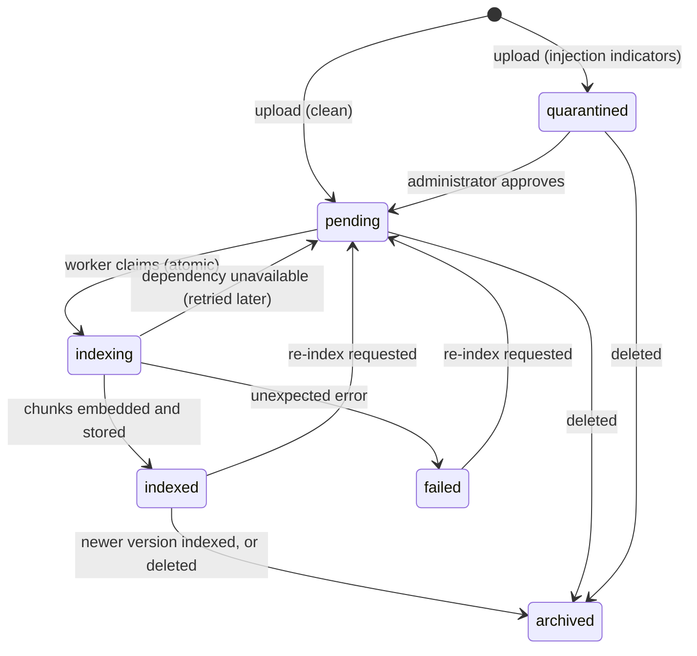

# Knowledge base and retrieval (RAG)

The assistant answers policy and product questions from the company's knowledge base, cites the
documents it used, and says so when the documents do not answer the question. Documents are
treated as **untrusted input**: an administrator can upload a file that (knowingly or not)
contains instructions aimed at the model - *indirect prompt injection* - and internal documents
must never reach customers.

## Lifecycle

| Step | Where | Controls |
|---|---|---|
| Upload | `POST /api/v1/admin/knowledge-base/documents` (multipart: file, title, category, visibility, optional slug and effective date) | `kb:manage`, administrative and upload rate limits, request size limit |
| Validation | `aegis.security.uploads` | see below |
| Screening | `KnowledgeService.upload` | the whole document is scored by the injection detector; suspicious documents are **quarantined** |
| Review | `POST .../{id}/approve` | only quarantined documents; the reviewer is recorded and audited |
| Indexing | the worker (`aegis worker`), `aegis index-kb`, or `?index_now=true` on upload | claimed with an atomic `pending -> indexing` update; suspicious *chunks* are dropped even from approved documents; bounded by a chunk cap |
| Versioning | same `slug` = new version | when the new version is indexed, older versions are archived and their vectors deleted, so two versions of one policy are never served together |
| Deletion | `DELETE .../{id}` | vectors deleted, document archived (the row is kept for the audit trail) |

Every step writes an audit event (`kb.upload`, `kb.approve_quarantined`, `kb.indexed`,
`kb.archive`). Documents stuck in `indexing` (a crashed worker) return to `pending` after 15
minutes.

### Upload validation

Nothing about an upload is trusted - not the name, not the declared type, not the bytes:

- only `.md`, `.markdown` and `.txt`, with a text or neutral content type; rich formats (PDF,
  Office, HTML) are refused because their parsers are a large attack surface;
- binary content is rejected by magic numbers (PDF, ZIP/Office, ELF, PE, images, archives, XML),
  NUL bytes and a control-character ratio;
- strict UTF-8 decoding (a BOM is tolerated), a maximum line length, a minimum useful length and
  `AEGIS_MAX_UPLOAD_BYTES`;
- the file name is reduced to `[A-Za-z0-9._-]`, directory parts and Windows device names are
  removed; it is display metadata only - content is stored in the database and never written to
  a path derived from the file name, so path traversal is impossible by construction;
- the text is normalised (NFKC, invisible characters removed) and hashed; an identical live
  document is refused (a partial unique index backs this up);
- parsing and embedding run in the worker process, isolated from the API that serves customers,
  with a chunk cap per document.

**Malware scanning** is not performed: only plain UTF-8 text is accepted and binary content is
rejected, so there is no executable or macro-capable format to scan. If richer formats (PDF,
Office) are ever added, add an antivirus scan and a sandboxed converter before indexing.

## Chunking

`chunk_markdown` follows the document's structure: it splits at headings first (each chunk keeps
its heading path, which becomes the citation's *section*), then packs long sections paragraph by
paragraph up to `AEGIS_RAG_CHUNK_CHARS` with `AEGIS_RAG_CHUNK_OVERLAP_CHARS` of overlap so a
sentence on a boundary remains retrievable. `AEGIS_RAG_MAX_CHUNKS_PER_UPLOAD` bounds the work one
(possibly hostile) document can cause.

## Embeddings

| Provider | When | Notes |
|---|---|---|
| `hashing` (default) | development, CI, demos, fully offline deployments | Deterministic feature hashing: word unigrams and bigrams plus character trigrams, light stemming, a small support-domain synonym map, sub-linear TF weighting, L2 normalisation. No network, no model download. Lexical rather than semantic. |
| `voyage` | production with semantic search | Voyage AI embeddings API through the egress policy (allow-listed host, HTTPS, no redirects, response size cap); responses are validated (count, dimensionality, finite numbers). Query embeddings are cached in Redis for an hour. |

`AEGIS_EMBEDDING_DIMENSIONS` must match the collection: a process whose embedder produces
vectors of a different size than the existing collection refuses to start instead of mixing
incompatible vectors. To switch the provider or the dimensions, index into a new collection:

1. stop the worker (the API can keep answering from the old collection);
2. with the new settings *and* a new `AEGIS_QDRANT_COLLECTION` name, run
   `aegis index-kb --rebuild` - it fills the empty collection with every indexed document;
3. deploy the API and the worker with the new settings, then delete the old collection.

## Vector store

Qdrant holds one point per chunk. The point id is derived deterministically from (document id,
chunk index), so re-indexing overwrites instead of duplicating. The payload carries the document
id, title, section, text, `category`, `visibility`, `slug` and `version`; on a Qdrant server
`visibility`, `category`, `document_id` and `slug` get payload indexes.

**Every search is filtered on visibility inside Qdrant**: a customer's query cannot even score an
internal document. The caller's visibility comes from their permissions (`kb:read_public`,
`kb:read_internal`), never from the request.

In production Qdrant runs as a server with an API key (`AEGIS_QDRANT_URL`,
`AEGIS_QDRANT_API_KEY`); in development qdrant-client's embedded mode is used (in memory or a
directory) and the index is rebuilt from the database at start-up when it is empty.

## Retrieval

`KnowledgeRetriever.retrieve` for one customer turn:

1. The query is the *model view* of the message (personal data already replaced), normalised and
   capped at 1,000 characters.
2. Vector search with the caller's visibilities and the intent's knowledge categories, returning
   up to `AEGIS_RAG_CANDIDATE_K` hits above `AEGIS_RAG_SCORE_THRESHOLD`. If the category filter
   finds nothing, the search is repeated over all categories the caller may see (categories are a
   relevance hint, not a security boundary).
3. Validation of the hits (defence in depth):
   - **authorisation re-check**: a hit whose visibility is not allowed is dropped, logged as an
     error and counted as `rag_visibility_violation` (it would indicate a filter bug);
   - **latest version only** per slug;
   - **diversity**: at most `AEGIS_RAG_MAX_CHUNKS_PER_DOCUMENT` chunks per document;
   - **injection screening**: chunks that read like instructions to an AI are withheld and counted
     as `rag_chunk_injection_blocked`;
   - **budget**: at most `AEGIS_RAG_TOP_K` chunks and `AEGIS_RAG_MAX_CONTEXT_CHARS` characters in
     total.
4. **Authority ordering**: chunks from the intent's primary category (for a refund question, the
   refund policy) come before secondary sources (the FAQ); relevance breaks ties. The prompt tells
   the model that documents are listed in order of authority and that the lower-numbered one wins
   when two disagree. This was added after a test showed a newer refund policy (45 days) being
   contradicted by an older FAQ answer (30 days).

When nothing relevant remains the model receives an empty `<knowledge_base>` block and is
instructed to say that it does not know and to offer a human, rather than to guess. When Qdrant is
unavailable the model is told not to answer policy questions from memory.

## Citations

Documents are numbered in the prompt (`<document index="1" title="..." section="...">`). The model
cites them as `[1]`, `[2]`. The output guard removes markers that point to documents that were not
provided; the API returns the cited documents (index, title, section) with the reply, and the
stored reply keeps the internal source ids (`slug@vN#chunk`) for staff.

## The demo knowledge base

`data/knowledge_base/manifest.toml` lists 13 fictional documents: FAQ, refund, shipping,
cancellation, warranty, payments, account security and privacy notices, three product guides
(public), and an escalation playbook and a fraud-review procedure (internal - never retrievable
for customers). `aegis seed` loads and indexes them; the test suite also uploads a deliberately
malicious document (`tests/fixtures/malicious-kb.md`) to verify quarantine and chunk screening.
