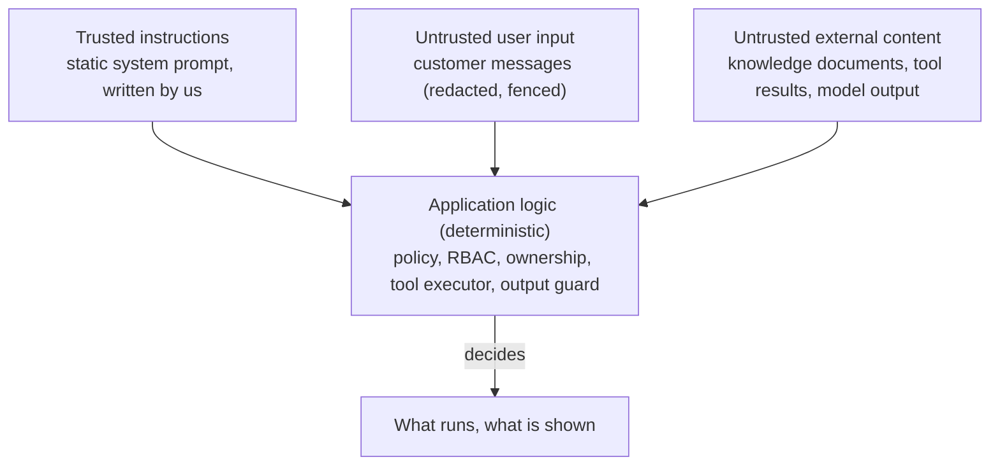

# Security architecture

This document lists the security controls, grouped by layer, and where each one lives in the
code. The threats they answer are analysed in [threat-model.md](threat-model.md); the evidence
that they work is in [security-audit.md](security-audit.md) and the test suite.

## Principles

1. **Never trust the model.** Its output is a proposal. Authorisation, tool access, escalation and
   output safety are decided by deterministic code that a prompt cannot change.
2. **Never trust input** - customer messages, uploaded documents, headers, file names, tool
   arguments and provider responses are all validated at the boundary where they enter.
3. **Least privilege** for every actor: customer, staff role, model turn, tool, database role,
   Redis user, container.
4. **Defence in depth**: each important property is enforced at two independent layers (e.g.
   visibility in the Qdrant filter *and* in a post-check; ownership in the service *and* in the
   SQL; audit immutability by grants *and* by trigger).
5. **Fail closed**: an unreachable budget store means "no budget"; a vector dimension mismatch
   stops the process; the encryption cipher refuses to work unconfigured; production refuses
   unsafe settings.
6. **Minimise data**: the model sees placeholders, tools return only what an answer needs, payment
   data is never stored, logs carry identifiers instead of content.

## Identity and authentication (`services/auth.py`, `services/mfa.py`, `security/passwords.py`, `security/tokens.py`, `security/totp.py`)

| Control | Detail |
|---|---|
| Password hashing | Argon2id (64 MiB, 3 iterations, 4 lanes by default), parameters upgraded transparently on login; hashing runs in a worker thread behind a semaphore, so a login flood cannot exhaust memory or block the event loop |
| Password policy | Minimum length (12), block-list of common passwords, no passwords derived from the e-mail address; no composition rules (NIST SP 800-63B) |
| No enumeration | Unknown account, wrong password, locked and disabled accounts give the same error; unknown accounts still pay for a dummy Argon2 verification (equal timing) |
| Brute force | Per-IP and per-account rate limits on login; lockout after 5 consecutive failures for 15 minutes |
| Access tokens | HS256 JWT, 15 minutes; the decoder pins the algorithm, requires all claims, checks issuer, audience, expiry and token type, caps the token length before parsing |
| Server-side sessions | Every request loads the session and the user: logout, logout-all, password change or reset, deactivation and role changes take effect immediately |
| Refresh tokens | 256-bit opaque, only SHA-256 digests stored, single use, rotated on every refresh; re-use of a spent token revokes the session (theft detection); absolute session lifetime |
| Password reset | Single-use, 30-minute, hashed token, sent by e-mail in the URL fragment; the request endpoint always answers the same; rate-limited per IP and per address; a reset revokes every session |
| Two-factor authentication | TOTP (RFC 6238, verified against the RFC test vectors) with 160-bit secrets encrypted at rest; enrolment requires the password; each time step is accepted once per account (atomic update, so observed codes cannot be replayed even concurrently); a correct password yields only a single-use, five-minute challenge that dies after five wrong codes, and wrong codes count towards the account lockout; ten single-use recovery codes with 80 random bits each, stored as SHA-256 digests; enabling revokes every session |
| Staff MFA policy | `AEGIS_MFA_REQUIRED_FOR_STAFF` (mandatory in production): until a staff member enrols, the principal holds no permission at all - only self-service sign-in management works; staff cannot switch the second factor off; an administrator resets a lost one (never their own), which revokes the user's sessions |
| Auth logging | Logins (with the second-factor method), failures (with a reason code, never the submitted value), second-factor challenges and failures, lockouts, refresh-token reuse, resets and admin changes are audit events |

## Authorisation (`security/rbac.py`, `services/authz.py`, `api/deps.py`)

- Four roles over 33 explicit permissions; the full matrix is generated into
  [api-reference.md](api-reference.md#role-permissions-rbac-matrix).
- **Capability** is checked by the route dependency (`require(permission)`) *and* again inside
  the service method, so a route that forgets the dependency still cannot perform the operation.
- **Ownership** is part of the SQL query: a customer is pinned to their own `customer_id`; staff
  need the `*_any` permission. Foreign records are reported as `404`, never `403`.
- Staff roles lack customer-only permissions: they cannot create a customer conversation or
  confirm a customer's refund; they act through their own audited endpoints.
- Administrators cannot demote, deactivate or lock out their own account; deactivation revokes
  every session.

## API layer (`middleware/`, `api/`)

| Control | Detail |
|---|---|
| Host header | `TrustedHostMiddleware` with an explicit list (no wildcard in production) |
| CORS | Off by default; explicit HTTPS origins in production; credentials never allowed |
| Body limits | `Content-Length` checked before reading; streamed bodies counted and aborted at the limit; separate upload limit |
| Content type | JSON required for body methods (blocks "simple" cross-site form posts); multipart only on the upload route |
| Validation | Pydantic models with `extra="forbid"`, length limits and patterns; path parameters validated (e.g. `ORD-` pattern); pagination capped (limit 100, offset 10,000) |
| Errors | RFC 9457 problem documents; no stack traces, SQL or exception text; 422 without input echo; generic 500 with the request id |
| Headers | `Content-Security-Policy: default-src 'none'`, `X-Content-Type-Options`, `X-Frame-Options: DENY`, `Referrer-Policy: no-referrer`, `Permissions-Policy`, COOP/CORP, `Cache-Control: no-store`, HSTS in production, no `Server` header |
| Client IP | `X-Forwarded-For` honoured only from configured proxies, right-most untrusted address (not spoofable by clients) |
| Request ids | Client-supplied ids accepted only if short and harmless (no log or header injection) |
| Rate limits | Sliding windows per IP, account, user and endpoint class; `Retry-After`; degrade to local counters, never fail open |
| Idempotency | `Idempotency-Key` on non-idempotent POSTs; per-user scope; replay, mismatch and in-flight semantics |
| Docs | `/docs` and `/openapi.json` disabled in production by default; `/metrics` behind a bearer token (constant-time comparison) |

## Trust separation

Only the top box contains instructions. Everything below it is *data* for the application logic,
which makes every decision that matters.

### Why prompt-level defences alone are insufficient

Telling the model "ignore malicious instructions" is necessary but cannot be relied on:

- **The model cannot reliably tell instructions from data.** Instructions and customer text reach
  it as the same kind of tokens; fencing and escaping help, but a sufficiently creative input can
  still change its behaviour. There is no parser-level boundary as there is in SQL.
- **Attacks are open-ended.** New phrasings, languages, encodings, role-play framings and
  instructions hidden in documents appear faster than any prompt or filter can list them - the
  injection detector here is a risk signal, not a gate.
- **Model behaviour is probabilistic and changes with model versions.** A prompt that resists an
  attack today may not tomorrow; security cannot depend on a property nobody can test
  exhaustively.
- **The consequences must not depend on the model's obedience.** So they don't: the model never
  holds credentials, never chooses whose data a tool reads (the session does), cannot execute a
  refund (the customer must confirm through the API), sees only the tools the policy allowed for
  this turn, and every reply passes the output guard. A fully successful injection is bounded to
  reading the signed-in customer's own data and producing text that is still validated.

## LLM security (`agents/`, `llm/`)

Mapped to the OWASP Top 10 for LLM Applications (2025) in [threat-model.md](threat-model.md#owasp-top-10-for-llm-applications).

| Control | Detail |
|---|---|
| Trust layout | Instructions only in the static system prompt; customer text, documents, summaries and application facts in named, HTML-escaped fences; tool results through the native tool channel |
| Injection detection | Weighted pattern categories over several normalised forms (NFKC, confusables, leetspeak, separators, invisible characters, mixed scripts, base64 blobs); bounded regexes, capped input |
| Risk-adaptive behaviour | Medium/high risk removes write and propose tools; repeated attempts escalate to a human; pure manipulation attempts are refused without a model call; every attempt is audited and counted |
| Least-privilege tools | Per-intent allow-list intersected with the role's permissions; per-turn and per-tool call budgets |
| Tool arguments | Re-validated with strict Pydantic models regardless of provider-side schema enforcement |
| Excessive agency | Refunds and cancellations are proposals; execution requires the customer's separate API call, an atomic state transition and a fresh rule evaluation (TOCTOU-safe) |
| Output guard | Blocks prompt leaks (canary + system-prompt shingles) and secrets; retries once on ungrounded reference numbers or amounts; removes exfiltration links and images, HTML, foreign contact details and payment identifiers; fixes citations; caps length |
| Data minimisation | PII replaced by placeholders before any text leaves; only an opaque fingerprint as the provider's user id; tools never return addresses, e-mail, phone numbers or other customers' data |
| Loops and cost | Iteration and tool-call caps, turn deadline, output-token caps, daily token and spend budgets, circuit breaker, offline fallback |
| Deterministic decisions | Escalation of security incidents, legal threats and explicit human requests cannot be talked away: signals and policy run in code, the classifier's `requires_human` is OR-ed with the signals |
| Structured output | Classification uses JSON schema output, is validated again, and cross-checked (order numbers must occur in the message; priority can only go up) |

## RAG security (`rag/`, `services/knowledge.py`, `security/uploads.py`)

Upload validation (text formats only, magic numbers, NUL and control characters, strict UTF-8,
size and line limits, sanitised file names, content stored in the database); document-level
injection screening with quarantine and audited approval; chunk-level screening at indexing and
again at retrieval; visibility filter inside Qdrant plus a post-check; latest version per slug;
per-document and total context budgets; authority ordering. Details: [rag.md](rag.md).

## Data protection (`security/crypto.py`, `security/redaction.py`, `db/base.py`)

| Data | Protection |
|---|---|
| Conversation text, summaries, ticket descriptions, refund notes, phone numbers, addresses | Encrypted per column (Fernet via MultiFernet, authenticated), key rotation with `aegis rotate-encryption` |
| Card numbers, CVV, credentials, SSNs, IBANs typed into chat | Never stored: removed before persistence; the customer is told not to share them |
| Card data from payments | Brand and last four digits only (CHECK constraint) |
| Text sent to model providers | Every PII category replaced by typed placeholders; Luhn and mod-97 checks keep false positives low; reference numbers are protected from the phone detector |
| Failed logins | For unknown accounts only a keyed fingerprint of the address is audited, never the address |
| TOTP secrets and recovery codes | Secrets encrypted like conversation text; recovery codes kept only as digests |
| Free text in plain columns | Conversation subjects and ticket subjects pass the same storage redaction as messages, so payment data and secrets never reach them |
| Logs | Content never logged; a redaction filter replaces sensitive keys wholesale and scrubs every value; JSON logs carry no tracebacks (required in production) |
| Audit details | Scrubbed and size-capped before storage |

## Privacy rights (`services/privacy.py`, `repositories/privacy.py`)

| Right | Implementation |
|---|---|
| Access / portability | `GET /privacy/export`: one JSON document with the profile, logins, orders, payments, refunds, conversations and tickets of the signed-in customer only; internal metadata excluded; rate-limited; audited without content |
| Erasure | Customers file a request (a `privacy` ticket, at most one per day); an administrator (`privacy:erase`, not held by agents or managers) erases after verification, typing the customer number as confirmation. Refused while orders, refunds or confirmed actions are in progress. Contact data and all free text are replaced, the login is disabled and renamed, a random unusable password set, sessions, reset tokens, idempotency records and second factors removed. Financial records stay for accounting but point to nobody. Irreversible and audited (counts only) |
| Storage limitation | `AEGIS_CONVERSATION_RETENTION_DAYS`: the worker replaces the text of finished conversations older than the period (batched, idempotent via `content_erased_at`) |

## Payments (`services/payments.py`, `security/webhooks.py`)

| Control | Detail |
|---|---|
| No unconfirmed money movement | Refunds need the customer's confirmation (proposal) or a manager's approval (`refund:decide`); the model can do neither |
| Exactly once | Every refund call carries an idempotency key derived from our refund record; the provider returns the original result for a repeated key; one open refund per order (partial unique index) |
| Provider isolation | The Stripe adapter reaches only the configured host through the egress policy (HTTPS, no redirects, response type and size checks); the secret key travels only in the `Authorization` header; a restricted key limited to refunds is recommended |
| Failure semantics | Business refusals (4xx) become `409 payment_rejected` with the provider's error code, the refund stays reviewable; outages (5xx, timeouts, 429) become `503`, safe to retry with the same key |
| Signed webhooks | HMAC-SHA256 over the raw body with the endpoint secret, constant-time comparison, five-minute replay window, several `v1` signatures for secret rotation; invalid signatures are rejected before parsing, audited and counted |
| Idempotent state changes | Only a `processing` refund changes, only to `completed` or `failed`; duplicate or out-of-order events are no-ops |
| Production | The simulated gateway (which moves no money) is refused in production |

## Secrets (`core/config.py`, `cli.py`)

- All secrets are `SecretStr`: never in `repr()`, logs or validation errors (which also never
  echo input).
- Empty variables mean "unset", so `AEGIS_METRICS_TOKEN=` cannot become an always-matching token.
- Strength checks: the JWT secret needs 32+ characters with variety; Fernet keys must be valid;
  the metrics token needs 16+ characters; placeholder-looking secrets are refused in production.
- `aegis init-env` / `aegis init-env --docker` generate fresh random secrets into an owner-only
  file; `.env` files are git- and docker-ignored; `.env.example` contains no values.
- Production: environment variables from a secret manager, or files in `AEGIS_SECRETS_DIR`
  (Docker/Kubernetes secrets).
- Keys are separated by purpose (JWT signing, field encryption, metrics, database roles, Redis,
  Qdrant, model, embedding and payment provider keys, webhook signing); the prompt canary is
  derived from the JWT secret with a purpose-specific label.

## Storage security

- **PostgreSQL**: three roles (bootstrap superuser, schema owner, runtime) with the runtime role
  unable to run DDL or modify the audit trail; append-only trigger; statement and idle-transaction
  timeouts; parameterised queries only; constraints for closed value sets, money consistency and
  one-open-refund-per-order; transactions around every business operation. See
  [database.md](database.md).
- **Redis**: the default user is disabled; the application user may only touch `aegis:*` keys and
  cannot run dangerous commands; memory is capped with `volatile-lru`; every key has a TTL; values
  are JSON validated on read (never pickle); nothing persisted to disk; internal network only.
- **Qdrant**: API key, internal network, unprivileged image; the index is rebuildable.

## Outbound requests (`core/egress.py`)

The server never connects to a URL chosen by a user, a document or the model. Provider calls go
through an egress policy: HTTPS only, exact host allow-list (the configured provider host), no IP
literals, no embedded credentials, default port only, length and control-character checks; the
client verifies TLS, does not follow redirects, applies connect and total timeouts, and refuses
non-JSON or oversized responses (streamed with a byte cap). Provider base URLs must be HTTPS
(checked at start-up).

## Operations and supply chain

- Containers: multi-stage build, non-root user (uid 10001), read-only root file system, `tmpfs`
  for `/tmp`, all capabilities dropped, `no-new-privileges`, PID limit, only the API published
  and only on loopback, data services on an internal network, pinned image versions.
- Dependencies: locked with hashes in `uv.lock`, installed with `--frozen`; `pip-audit` for known
  vulnerabilities; `bandit` for insecure patterns; strict mypy and ruff (including the security
  rule set) on every change.
- Monitoring: security events (`aegis_security_events_total`) for authorisation denials,
  injection attempts, blocked prompt leaks, quarantined documents, visibility violations,
  tool denials and rate-limiter degradation; an append-only audit trail for investigations. See
  [operations.md](operations.md).
